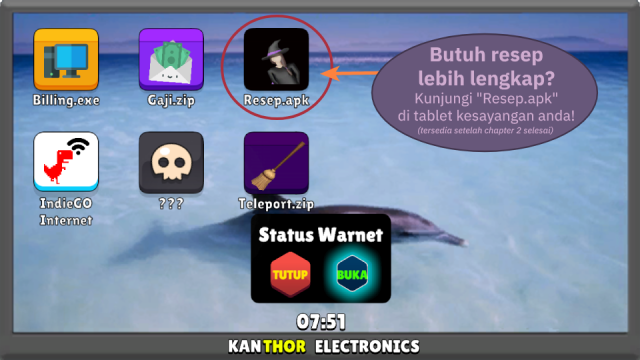

# Warnet Life: Racikan Penyihir

> Gatsby JS Edition (Powered by ReactJS, under Node)

<p align="center" style="text-align:center"></p>

<p align="center" style="text-align:center"><strong>Hai cinta, selamat datang di rumahku!</strong></p>

<p align="center" style="text-align:center">Mau racik resep apa hari ini?</p>

Laman ini dibuat untuk menampilkan resep-resep racikan penyihir yang tersedia dari **jam 00:00-03:00**. Anda dapat menggunakan resep racikan dari laman ini atau melalui tablet kesayangan anda di Warnet Life.

## Cara Akses Resep / Lokasi Racikan Penyihir



Kunjungi **"Resep.apk"** di tablet kesayangan anda untuk resep-resep racikan kesayangan anda.

Untuk lokasi racikan dapat diakses di belakang lapangan basket setelah menyelesaikan **chapter 2**.

## Daftar Racikan

Untuk saat ini, tersedia 22 resep racikan yang terbagi atas 4 kategori, yaitu:

### Easter Egg

#### Painting

| Item 1        | Item 2     | Item 3  | Item 4  | Hasil Racikan          |
| :-------:     | :--------: | :-----: | :-----: | :---------------:      |
| Kotak Rahasia | Garam Suci | Sandal  | Kamera  | Windah Casino Painting |
| Kotak Rahasia | Garam Suci | Sandal  | Mouse GG | Perempuan Hilang |
| Kotak Rahasia | Garam Suci | Sandal  | Jam     | Aci GameSpot |
| Kotak Rahasia | Garam Suci | Sandal  | PC GG   | Vote Rizad |
| Kotak Rahasia | Garam Suci | Sandal  | Patung Bomby | Rio Mascara |
| Kotak Rahasia | Garam Suci | Sandal  | Bunga Ungu | Les Mefelz |
| Kotak Rahasia | Garam Suci | Sandal  | Monitor GG | Pied De Obit |

#### Disc & Stuffs

| Item 1        | Item 2     | Item 3  | Item 4  | Hasil Racikan          |
| :-------:     | :--------: | :-----: | :-----: | :---------------:      |
| Kotak Rahasia | Garam Suci | Sandal  | Mangkok Legendaris | Kimi No Life Music Disc |
| Kotak Rahasia | Garam Suci | Sandal  | Pentungan | MiawAug Wibu Music Disc |
| Kotak Rahasia | Garam Suci | Sandal  | Gelas Biasa | Gelas MiawAug |
| Kotak Rahasia | Garam Suci | Sandal  | Gelas MiawAug | Sokocha |

### Tengkorak (Penting untuk misi utama chapter 3)

| Item 1    | Item 2          | Item 3  | Item 4      | Hasil Racikan      |
| :-------: | :--------:      | :-----: | :-----:     | :---------------:  |
| Pentungan | Kotak Peralatan | Sandal  | Garam Suci  | Tengkorak Putih    |
| Pentungan | Kotak Peralatan | Kotak Rahasia  | Jam  | Tengkorak Merah    |
| Pentungan | Kotak Peralatan | Mangkok Legendaris | PC GG | Tengkorak Hijau    |
| Pentungan | Kotak Peralatan | Sandal  | Jam         | Tengkorak Biru     |
| Tengkorak Putih | Tengkorak Merah | Tengkorak Hijau | Tengkorak Biru | Tengkorak Emas |

### Perlengkapan Penyihir (Witch's Stuffs)

| Item 1    | Item 2     | Item 3  | Item 4      | Hasil Racikan      |
| :-------: | :--------: | :-----: | :-----:     | :---------------:  |
| Peti Mati | Bunga Ungu | Bunga Hitam  | Bunga Putih  | Peti Mati (Meja)  |
| Peti Mati Emas | Bunga Ungu | Bunga Hitam | Bunga Putih | Peti Mati Emas (Meja) |
| Peti Mati | Peti Mati (Meja) | Kuali Mini | Batu Nisan | Sapu |

### Painting Game Warnet Life

| Item 1        | Item 2     | Item 3      | Item 4      | Hasil Racikan        |
| :-----:       | :-----:    | :-----:     | :-----:     | :---------------:    |
| Kotak Rahasia | Garam Suci | Monitor GG  | PC GG       | ??? (Warnet Life)    |
| Kotak Rahasia | Garam Suci | Toilet      | Toilet      | ??? (Napos)          |
| Kotak Rahasia | Garam Suci | Toilet Emas | Toilet Emas | ??? (Secret Ending?) |

## Technical Notes

### The GatsbyJS version

<p align="center">
  <a href="https://www.gatsbyjs.com/?utm_source=starter&utm_medium=readme&utm_campaign=minimal-starter"  title="GatsbyJS (gatsbyjs.com)" style="margin:1rem">
    
  </a>
  <a href="https://reactjs.org/" title="ReactJS (reactjs.org)" style="margin:1rem">
    
  </a>
</p>

Repository ini merupakan versi GatsbyJS dari [warnet-life-racikan-penyihir](https://github.com/estehbunny/warnet-life-racikan-penyihir), di mana sistem rendering pada halaman didasarkan pada direktori `/src` dan dikerjakan oleh framework Gatsby (berbasis ReactJS).

### JSON

Berbeda dengan repository versi HTML + Pure JS, repository ini menggunakan data JSON yang terdiri dari 3 file, yaitu:

1.  `item.json`
    ```json
    [
      {
        "id": "kotak-rahasia",
        "path": "kotak-rahasia",
        "description": "kotak rahasia"
      },
      {
        "id": "garam-suci",
        "path": "garam-suci",
        "description": "garam suci"
      },
      {
        "id": "sandal",
        "path": "sandal",
        "description": "sandal"
      }, // and more item unlisted here
    ]
    ```

2. `pricelist.json`
    ```json
    [
      {
        "path": "kotak-rahasia",
        "description": "kotak rahasia",
        "cost": {
          "cash": 13000000
        }
      },
      {
        "path": "garam-suci",
        "description": "garam suci",
        "cost": {
          "cash": 1000000
        }
      },
      {
        "path": "sandal",
        "description": "sandal",
        "cost": {
          "cash": 500000
        }
      }, // and more item pricelist unlisted here
    ]
    ```

3.  `recipe-category.json`
    ```json
    [
      {
        "category": "Easter Egg",
        "recipes": [
          "windah-casino",
          "easter-egg-cendy",
          "easter-egg-aci-gamespot",
          "easter-egg-rizad",
          "easter-egg-rio", // and many more...
        ]
      },
      {
        "category": "Tengkorak",
        "recipes": [
          "tengkorak",
          "tengkorak-merah",
          "tengkorak-biru",
          "tengkorak-hijau",
          "tengkorak-emas"
        ]
      }, // and another categories unlisted here
    ]
    ```

4. `resep.json`
    ```json
    [
      {
        "recipe1": "kotak-rahasia",
        "recipe2": "garam-suci",
        "recipe3": "sandal",
        "recipe4": "kamera",
        "result":  "windah-casino"
      },
      {
        "recipe1": "kotak-rahasia",
        "recipe2": "garam-suci",
        "recipe3": "sandal",
        "recipe4": "mouse-gamer",
        "result":  "easter-egg-cendy"
      },
      {
        "recipe1": "kotak-rahasia",
        "recipe2": "garam-suci",
        "recipe3": "sandal",
        "recipe4": "jam",
        "result":  "easter-egg-aci-gamespot"
      }, // and more recipes unlisted here
    ]
    ```

### Run this repository locally!

Navigate into cloned repository's directory and start it up.

```shell
cd warnet-life-racikan-penyihir-gatsby/
npm run develop
```

Or using Gatsby CLI command installed from `npm install -g gatsby-cli`:

```shell
gatsby develop
```


### Quick start (Gatsby Cloud)

Deploy this starter with one click on [Gatsby Cloud](https://www.gatsbyjs.com/cloud/):

[](https://www.gatsbyjs.com/dashboard/deploynow?url=https://github.com/estehbunny/warnet-racikan-penyihir-gatsby)


## Support Me!

<p align="center" style="text-align:center"></p>

Anda dapat Fork repository ini untuk improvisasi atau beri bintang di laman repository ini untuk anda simpan di daftar favorit anda!

**See you :wink:** - EsTehBunny (:ice_cube::tropical_drink::rabbit:)
